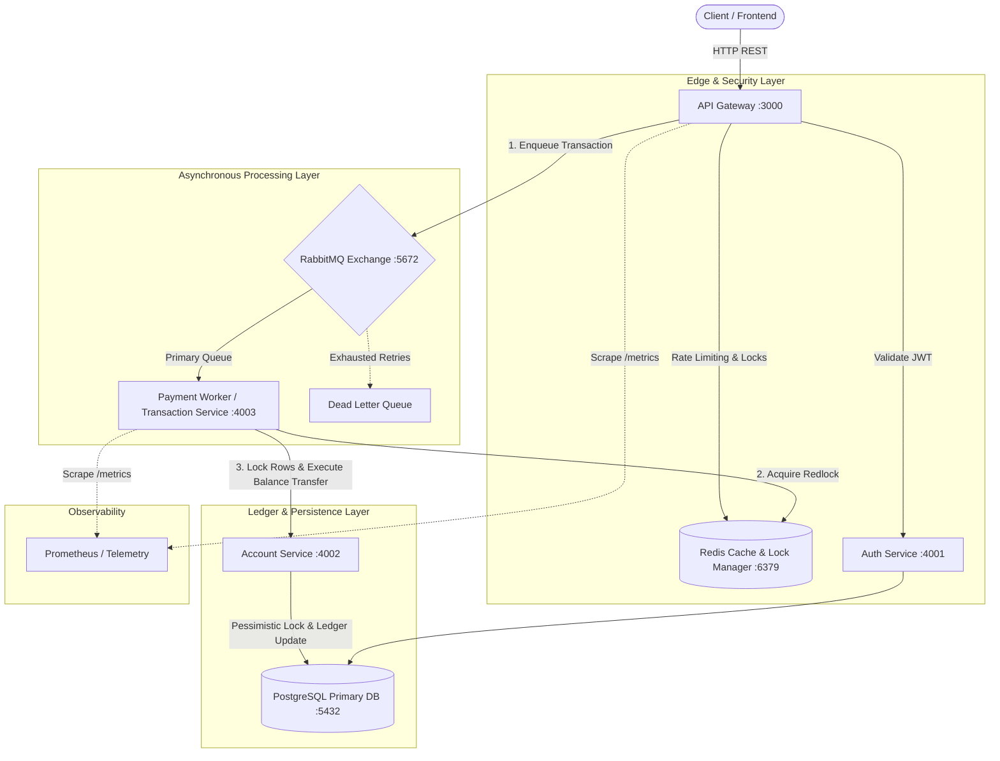
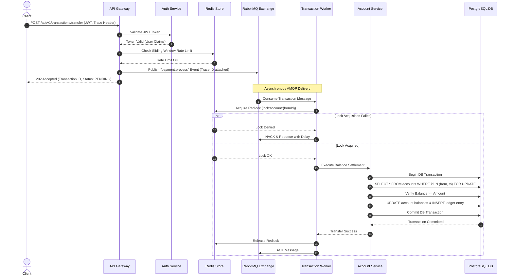

# Distributed Event-Driven Banking Engine

A production-grade, distributed microservices platform designed for high-frequency financial transactions. The system guarantees atomic ledger operations, zero double-spending, distributed tracing, resilient failure handling, and automated containerized deployments.

---

## 1. Executive Summary & Purpose

Modern financial engines require extreme availability, strict data consistency, and sub-second processing under heavy load. Traditional monolithic architectures suffer from single points of failure, database lock contention, and poor horizontal scalability during peak traffic.

This system solves these core distributed systems challenges by separating synchronous client interactions from asynchronous ledger settlement:

* **Zero Double-Spending Guarantee**: Achieved using a two-tier locking mechanism (Redis atomic distributed mutex at the orchestration layer and PostgreSQL row-level pessimistic locking at the database layer).
* **High Availability & Fault Tolerance**: Isolates service failure using circuit breakers, rate limiters, dead-letter queues, and automated backoff retries.
* **End-to-End Tracing**: Tracks every request across network boundaries and event streams via explicit correlation IDs.
* **Eventual Consistency with Strict Isolation**: Decouples API availability from ledger processing, allowing high transaction submission throughput even under transient database loads.

---

## 2. System Architecture

The infrastructure consists of four primary microservices communicating synchronously via REST at the ingress layer and asynchronously via RabbitMQ AMQP messaging at the core processing layer.



---

## 3. Technology Stack & Design Rationale

| Layer / Concern | Technology Chosen | Technical Rationale & Alternatives Considered |
| --- | --- | --- |
| **API Gateway** | Express.js | Acts as a single entry point for routing, authentication verification, response transformation, and edge rate limiting. Reduces client-side complexity. |
| **Messaging & Queuing** | RabbitMQ (AMQP) | Selected over Kafka due to native support for queue-level routing, flexible Exchange models (Direct/Topic), built-in Dead Letter Exchanges (DLX), and transactional message acknowledgments required for financial tasks. |
| **Distributed Locking** | Redis (Lua / Redlock) | Offers high-performance, key-value atomic memory locks. Prevents duplicate transactions from entering the message processing pipeline simultaneously. |
| **Relational Storage** | PostgreSQL | Selected over MongoDB/NoSQL due to strict ACID compliance, relational integrity across accounts/ledgers, and support for explicit row-level locking capabilities. |
| **Resilience & Circuit Breaking** | Opossum | Prevents cascading failures. If downstream balance settlement services fail, the circuit opens, failing fast to preserve system resources. |
| **Telemetry & Metrics** | Prometheus + Winston | Prometheus tracks RED metrics (Rate, Errors, Duration) and state changes. Winston generates structured JSON logs tagged with a unified trace ID. |
| **Container Orchestration** | Docker Compose + Jenkins | Multi-stage Docker builds maintain minimal image footprints. Jenkins automates testing, linting, building, and rolling updates. |

---

## 4. Core Subsystems & Implementation Details

### 4.1 API Gateway Service

* **Edge Interception**: Receives all incoming traffic, inspects `x-correlation-id` headers (or injects a unique UUID if absent), and propagates it down the request chain.
* **Authentication Proxy**: Validates incoming JWT bearer tokens against the Auth Service before forwarding requests to internal network services.
* **Sliding Window Rate Limiter**: Leverages Redis memory stores to block DDoS attacks or rogue API consumers without stressing underlying database layers.

### 4.2 Auth Service

* **Identity Management**: Handles user registration, credentials hashing, and session token generation using asymmetric/symmetric JWT signatures.
* **RBAC & Authorization**: Embeds user roles and scope claims within JWT tokens to allow downstream microservices to perform stateless permission checks.

### 4.3 Transaction Service (Event Producer & Consumer Worker)

* **Ingress Queue Producer**: Accepts transfer requests, runs rapid schema validation, checks user balance constraints conceptually, pushes messages to the RabbitMQ Exchange, and returns an immediate response to the client.
* **Egress Payment Worker**: Listens to the AMQP payment queue, manages distributed locking lifecycle, coordinates with the Account Service to execute transactions, and handles failure retries.

### 4.4 Account Ledger Service

* **Ledger Management**: Holds the source of truth for account balances and audit histories.
* **Atomic Ledger Execution**: Executes balanced ledger updates (debiting source account and crediting destination account) inside an isolated database transaction block.

---

## 5. Concurrency Control & Double-Spending Prevention

In a high-concurrency environment, duplicate API submissions or concurrent worker consumption could allow a user to spend the same balance twice. This system enforces balance safety using a two-tier protection model.

```
       Incoming Request (Transfer $100 from Account A)
                              │
                              ▼
            ┌───────────────────────────────────┐
            │ Tier 1: Redis Distributed Mutex   │
            │   (Key: lock:account:A)           │
            └─────────────────┬─────────────────┘
                              │
               Acquired? ─────┴───── Denied?
                   │                    │
                   ▼                    ▼
     ┌───────────────────────────┐  Reject Request
     │ Tier 2: PostgreSQL Row    │  (429 / 409 Conflict)
     │   Pessimistic Locking     │
     │   (FOR UPDATE)            │
     └─────────────┬─────────────┘
                   │
                   ▼
     ┌───────────────────────────┐
     │ Verify Sufficient Balance │
     │ & Update Ledger Account A │
     └─────────────┬─────────────┘
                   │
                   ▼
     ┌───────────────────────────┐
     │ Balance Updated & Lock    │
     │ Released                  │
     └───────────────────────────┘

```

### Tier 1: Redis Distributed Mutex (Orchestration Layer)

Before processing a transfer, the worker attempts to acquire an explicit lock key matching the sender's account ID in Redis using atomic Lua execution.

* If the lock is successfully acquired, a short TTL (Time-to-Live) is assigned to prevent deadlocks in case of worker node crashes.
* If another worker is processing a transaction for the same account, lock acquisition fails, and the request is safely retried or rejected.

### Tier 2: PostgreSQL Row-Level Pessimistic Locking (Database Layer)

When the Account Service updates balance accounts:

1. It opens an explicit PostgreSQL database transaction block.
2. It executes a query fetching the account record using a pessimistic row-level locking clause.
3. This forces concurrent database queries attempting to access the same row to wait until the holding transaction issues a commit or rollback.
4. Accounts are always queried and locked in a consistent numerical sequence (e.g., locking lower account IDs first) to prevent database deadlocks.

---

## 6. Resilience, Retries, and Fault Tolerance

Financial event processing cannot afford message loss. The asynchronous engine implements a dead-letter mechanism coupled with circuit breakers.

### Asynchronous Retry Engine Flow

1. **Normal Processing**: The worker processes the transaction message from the primary queue.
2. **Transient Failure**: If a transient error occurs (e.g., database timeout), the worker increments a header retry counter and publishes the message to a Retry Exchange equipped with a Per-Message TTL.
3. **Delayed Requeueing**: Once the TTL expires, the message is automatically routed back to the primary processing queue.
4. **Exponential Backoff**: Delay periods grow exponentially on each failed attempt to allow downstream services time to recover.
5. **Poison Pill Isolation**: If maximum retry attempts are exhausted, the message is routed to the Dead Letter Queue (DLQ) for human intervention or manual replay scripts, ensuring the primary queue is never blocked.

### Circuit Breaker Integration

The connection between the Transaction Worker and the Account Service is wrapped in an Opossum Circuit Breaker:

* **Closed State**: Normal operation; requests pass through.
* **Open State**: Triggered when error thresholds are crossed. All incoming processing requests are immediately rejected or held, preventing catastrophic cascading failures down the chain.
* **Half-Open State**: Periodically routes trial requests to test if downstream dependencies have recovered before returning to a Closed state.

---

## 7. End-to-End Execution Sequence

The diagram below outlines the full lifecycle of a money transfer request from initial client submission to final execution.



---

## 8. Distributed Observability & Telemetry

Understanding state in a distributed engine requires cross-service context propagation and metric scraping.

### Correlation ID Tracing

* The API Gateway captures or generates an `x-correlation-id` header upon entry.
* This identifier is attached to Express request objects, injected into outgoing HTTP request headers, and embedded inside RabbitMQ AMQP message metadata payload attributes.
* If a failure occurs in a deeply nested async background task, searching the system logs for the single Correlation ID aggregates the complete lifecycle history across all microservice boundaries.

### Structured JSON Logging

* System output skips plain-text console lines in favor of rigid JSON structures output via Winston.
* Fields include `timestamp`, `level`, `service`, `correlationId`, `message`, and structured error metadata (stack traces).
* Standardized log outputs allow collectors (such as Logstash or Promtail) to parse and index fields without regular expressions.

### Prometheus Operational Metrics

Each service exposes an unauthenticated `/metrics` endpoint monitored by Prometheus:

* **HTTP Latency Histogram**: Tracks API Gateway processing distribution and identifies slow routes.
* **Circuit Breaker State Gauge**: Exposes metric values (0 = Closed, 1 = Open, 0.5 = Half-Open) to trigger alerts if downstream dependencies drop.
* **Queue Message Processing Counters**: Tracks message throughput rates, success counters, and failure/retry increments.

---

## 9. Infrastructure, Containerization & CI/CD Strategy

### Multi-Stage Containerization

Services utilize multi-stage Alpine-based `Dockerfiles` to minimize attack vectors and overall image footings:

1. **Dependencies Stage**: Copies dependency configurations and runs `npm ci --only=production` to isolate dependencies.
2. **Production Stage**: Copies minimal runtime dependencies and application source files from the base stage, setting the container user context to an unprivileged standard user (`USER node`).

### Orchestration

The root `docker-compose.yml` acts as the environment coordinator:

* Manages runtime startup order via explicit dependency conditions.
* Bridges all isolated service runtimes through a dedicated bridge network (`backend-network`).
* Uses Docker internal DNS to map environment connection variables (e.g., using service names like `postgres`, `redis`, or `rabbitmq` instead of `localhost`).

### Declarative Jenkins Pipeline

Continuous integration and deployment are governed by a root `Jenkinsfile`:

1. **Checkout**: Pulls source code from version control.
2. **Unit & Integration Tests**: Runs mock test suites inside transient containers.
3. **Build Stage**: Builds immutable Docker images using build numbers for tagging.
4. **Security Scan**: Audits third-party dependency vulnerabilities.
5. **Zero-Downtime Rollout**: Uses Compose commands to pull updated layers, recreate modified containers, and prune dangling images safely.

---

## 10. Local Setup & Execution Guide

### Prerequisites

* **Docker** (v20.10 or higher)
* **Docker Compose** (v2.0 or higher)
* **Postman** (Optional, for testing API endpoints)

### Environment Initialization

1. Clone this repository locally.
2. Ensure local ports `3000` (Gateway), `4001` (Auth), `4002` (Account), `4003` (Transaction), `5432` (Postgres), `6379` (Redis), and `5672/15672` (RabbitMQ) are free.
3. Ensure executable permissions are granted to container build scripts if custom entrypoints are added.

### Cluster Operations

To build images and boot the full microservices cluster:

```bash
# Build and start all services in detached mode
docker-compose up -d --build

# Inspect status of all cluster nodes
docker-compose ps

# Tail log streams across all microservices
docker-compose logs -f

# Stop and teardown all services and virtual networks
docker-compose down -v

```

### Verification Endpoints

* **API Gateway Health**: `GET http://localhost:3000/health`
* **Prometheus Gateway Metrics**: `GET http://localhost:3000/metrics`
* **RabbitMQ Management Dashboard**: `http://localhost:15672` (Credentials configured in `docker-compose.yml`)